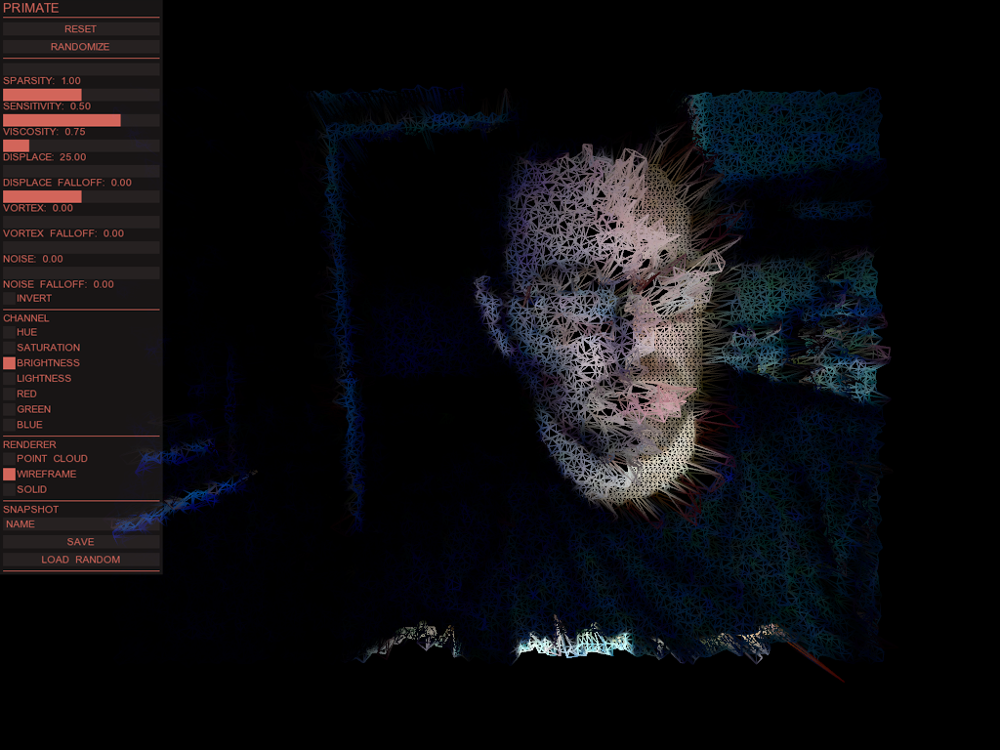

# primate
PRIMATE was installed in a gallery "Masks" show at 3DEXCITE, the CG studio where I worked at the time. From the placard:

PRIMATE is an experimental realtime 3D “mask” powered by openFrameworks, an open source C++ toolkit for
creative coding. PRIMATE turns your mug into a 3D primitive. The webcam in front of you captures pixels,
which PRIMATE converts into vertices (3D points) on a plane primitive (a flat mesh). The pixel color data is used
to translate and rotate the vertices in 3D space in various ways. The medium of this work is math, and the
subject is you; just a bit more primitive.

Dependencies:
- [openFrameworks 0.8.4](http://openframeworks.cc/download/older/)
- ofxXmlSettings (included in openFrameworks release)
- [michdolan/ofxUI](../../../ofxUI)
- [michdolan/ofxEasyCam](../../../ofxEasyCam)

